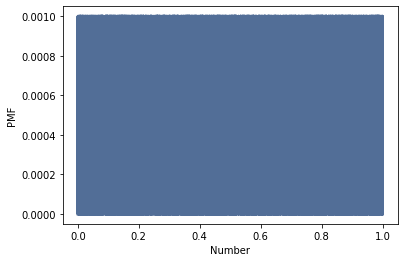
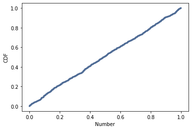

[Think Stats Chapter 4 Exercise 2](http://greenteapress.com/thinkstats2/html/thinkstats2005.html#toc41) (a random distribution)

```python
import numpy as np
import thinkstats2
import thinkplot

# generate 1000 random numbers
random_numbers = np.random.random(1000)

# plot the PMF of the random numbers
pmf = thinkstats2.Pmf(random_numbers)
thinkplot.Pmf(pmf)
thinkplot.Config(xlabel='Number', ylabel='PMF')

# plot the CDF of the random numbers
cdf = thinkstats2.Cdf(random_numbers)
thinkplot.Cdf(cdf)
thinkplot.Config(xlabel='Number', ylabel='CDF')
```

Technically, as is the case with any "random number generator" in a computer,
the output isn't truly random. They use pseudo random algorithms, typically
with some sort of seeded input.

However, if we take random to mean that the generated numbers are uniformly
distributed and that ever number has the same probability, then we can evaluate
that with the PMF and CDF.

Plotting the PMF results in a dark square because at each value is a line of
equal probability. This indicates a uniform distribution, but isn't the most
clear visual representation.



Plotting the CDF results in an approximately
straight line - confirming that the distribution is uniform and that
`np.random.random` does in fact yield an effectively random sample.


