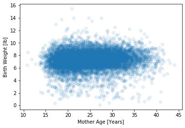

[Think Stats Chapter 7 Exercise 1](http://greenteapress.com/thinkstats2/html/thinkstats2008.html#toc70) (weight vs. age)

```python
import first
import matplotlib.pyplot as plt
import numpy as np
import pandas as pd
import thinkstats2

# load and only use live birth data
live, firsts, others = first.MakeFrames()
live = live.dropna(subset=['agepreg', 'totalwgt_lb'])

# plot scatter plot
plt.scatter(x=live['agepreg'], y=live['totalwgt_lb'], alpha=0.1)
plt.xlabel('Mother Age [Years]')
plt.ylabel('Birth Weight [lb]')
plt.show()
```

Plotting a scatter plot of birth weight vs. mother's age yields:



The *Pearson correlation* is `0.06883` and the *Spearman correlation* is
`0.09461`. This implies a weak positive liner relationship between birth
weight and mother's age. The difference between the correlation implies either
skew or that they are correlated non-linearly. 
