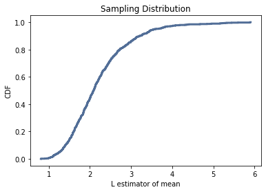

[Think Stats Chapter 8 Exercise 2](http://greenteapress.com/thinkstats2/html/thinkstats2009.html#toc77) (scoring)

```python
import numpy as np
import matplotlib.pyplot as plt
import thinkstats2
import thinkplot

def estimate_exponential(n, lam, m):
    """Runs an estimation m times for a sample of size n, using an exponential distrubtion with lambda lam."""
    means = []
    for i in range(m):
        x = np.random.exponential(1.0/lam, n)
        L = 1 / np.mean(x)
        estimates.append(L)

    return estimates

def calculate_rmse(estimates, actual):
    """Computes the root mean squared error of a sequence of estimates.

    estimate: sequence of numbers
    actual: actual value

    returns: float RMSE
    """
    e2 = [(estimate-actual)**2 for estimate in estimates]
    mse = np.mean(e2)
    return np.sqrt(mse)

# simulate the experiment 1000 times for a given lambda and sample size
n = 10
lam = 2
m = 1000
estimates = estimate_exponential(n, lam, m)

# plot the sampling distribution of the estimator L
cdf = thinkstats2.Cdf(estimates)
thinkplot.Cdf(cdf)
thinkplot.Show(xlabel='L estimator of mean', ylabel='CDF', title='Sampling Distribution')

# compute the standard error of L
print(f'Standard Error: {calculate_rmse(means, lam)}')

# compute the 90% confidence interval
cdf.Percentile(5), cdf.Percentile(95)
```

For `n = 10`, `lam = 2`, and `m = 1000`, estimating lambda 1000 times for a
randomly generated exponentially distributed sample yields a *Standard Error* of
`0.7916`. The *90% Confidence Interval* for the resulting estimates is
`(1.3054596477874765, 3.6494451703235957)`. The plot of the sampling
distribution can be seen below:



```python
# choose a few different values for sample size and plot standard error vs. n
n_options = [10, 30, 60, 90, 125]
standard_errors = []
for ni in n_options:   
    estimates = estimate_exponential(ni, lam, m)
    standard_errors.append(calculate_rmse(estimates, lam))
    cdf = thinkstats2.Cdf(estimates)
    print(f'Confidence Interval for n={ni}: {cdf.Percentile(5), cdf.Percentile(95)}')

plt.plot(n_options, standard_errors)
plt.xlabel('Sample Size')
plt.ylabel('Standard Error')
plt.show()
```

Standard error decreases as sample size increases. This relationship is plotted
below:


The 90% confidence intervals for each sample size `n` are:

```
Confidence Interval for n=10: (1.2729440065393558, 3.4432048559922634)
Confidence Interval for n=30: (1.5330101301551284, 2.758214651756132)
Confidence Interval for n=60: (1.6318802983310488, 2.5522233526390594)
Confidence Interval for n=90: (1.6841195020197661, 2.3931224615253672)
Confidence Interval for n=125: (1.749551293515187, 2.318327977128176)
```

The 90% confidence interval decreases as sample size increases. As expected,
with more data, we can be more confident that any estimate will fall within a
smaller range of values.
