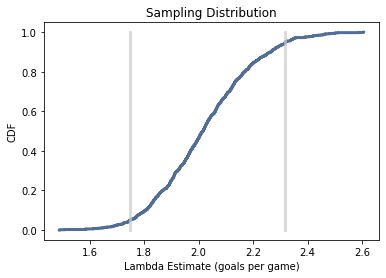

[Think Stats Chapter 8 Exercise 3](http://greenteapress.com/thinkstats2/html/thinkstats2009.html#toc77)

```python
import numpy as np
import thinkstats2
import thinkplot

def simulate_game(lam):
    """
    Simulates a game by generating the time between goals until the total time exceeds 1 game and returns the number
    of goals scored. Uses lambda (lam) as the goal-scording rate.
    """
    t = 0
    goals = 0
    while True:
        time_between_goals = np.random.exponential(1/lam)
        t += time_between_goals
        if t > 1:
            break

        goals += 1

    return goals

def calculate_mean_error(estimates, actual):
    """Computes the mean error of a sequence of estimates.

    estimate: sequence of numbers
    actual: actual value

    returns: float Mean Error
    """
    e = [(estimate-actual) for estimate in estimates]
    return np.mean(e)


def calculate_rmse(estimates, actual):
    """Computes the root mean squared error of a sequence of estimates.

    estimate: sequence of numbers
    actual: actual value

    returns: float RMSE
    """
    e2 = [(estimate-actual)**2 for estimate in estimates]
    mse = np.mean(e2)
    return np.sqrt(mse)

def simulate_multiple_games(lam=3, m=1000):
    """
    Simulates multiple games and computes the mean error and RMSE of the estimate for goals per game.

    Some quick research yields a typical score for both hockey and soccer to be in the direction of 3 goals
    """
    goal_estimates = []
    for i in range(m):
        goal_estimates.append(simulate_game(lam))

    mean_error = calculate_mean_error(goal_estimates, lam)
    rmse = calculate_rmse(goal_estimates, lam)
    return estimates, mean_error, rmse

    # simulate many games
    estimates, mean_error, rmse = simulate_multiple_games()

# plot sampling distribution
cdf = thinkstats2.Cdf(estimates)
thinkplot.Cdf(cdf)
thinkplot.Show(xlabel='L estimator of mean', ylabel='CDF', title='Sampling Distribution')

# calculate MSE and Standard Error
print(f'Mean Error: {mean_error}')
print(f'RMSE (Standard Error): {rmse}')
```

Simulating 1000 games, assuming that `lam` (lambda; goals per game) is
3 (after some quick googling of average goals per game in soccer/hockey and
rounding up) yields a mean error of `0.008` and standard error (RMSE) of
`1.7533`. The confidence interval is `(1.7496, 2.3183)`.

The plot below shows the sampling distribution of these simulations
with confidence interval indicated.



The book says to try increasing values of `lam`, but I think this might be a
mistake because in order to determine if the method of estimation is biased,
you actually want to increase `m`, the number of experiments.

```python
m = [1000, 2500, 5000, 7500, 10000]
sampling_errors = []
for m_i in m:
    estimates, mean_error, rmse = simulate_multiple_games(lam=3, m=m_i)
    sampling_errors.append(mean_error)

plt.plot(m, sampling_errors)
plt.xlabel('m (# of experiments)')
plt.ylabel('Sampling Error')
plt.show()
```

Mean error begins small and appears to generally converge towards 0 as `m`
increases. Therefore, this estimator is unbiased.
